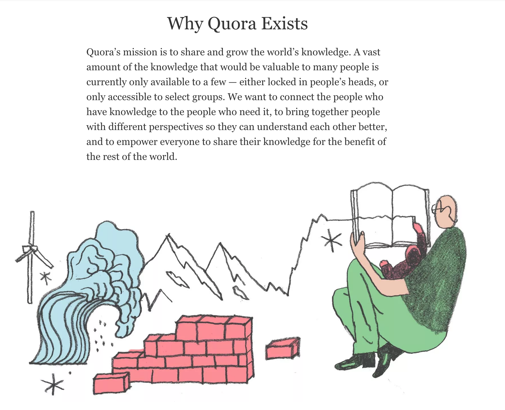

= MSAN 662: Introduction to Data and Information Visualization
Jonathan Dinu <https://github.com/Jay-Oh-eN[@clearspandex]>

|===
| **Semester**: | Spring 2015 • Module II
| **Lectures** | Tuesday, Thursday • 3:00pm – 4:50pm
| **Discussion** | Thursday • 1:00pm – 2:50pm
| **Location** | 101 Howard, Room 529
|===

This course will address basic data visualization techniques and design principles. Students will obtain practical experience with the visualization of complex data, including multivariate data, geospatial data, textual data, time series, and network data.

== Instructor

Please contact the instructor if you have any questions or concerns regarding the course or projects.

[caption='']
.Jonathan Dinu
|===
| **Web:** | http://hopelessoptimism.com
| **Email:** | jondinu@gmail.com
| **Office:** | TBD
| **Hours:** | TBD
|===

If you are unable to make these office hours, please contact the instructor to setup an appointment.

== Prerequisites

You must have completed MSAN 501, 593, and 692 with a grade of C or better.

== Logistics

* https://usfca.instructure.com/courses/1557793/announcements[Announcements] will be made on Canvas
* https://usfca.instructure.com/courses/1557793/gradebook[Grades] will be posted to Canvas
* https://usfca.instructure.com/courses/1557793/external_tools/19368[Chat] will be on Canvas
* Lectures will be recorded and added to the https://www.youtube.com/playlist?list=PLmetp36hFxezp8dxF0RxwOuS6owdadoqz[YouTube playlist]

////
_All other materials will be on the jay-oh-en.github.io/courses/usf-datavis[course web page] or https://www.quora.com/topic/Usf-data-viz2016[Quora]_
////

== Materials

There are no books required for this class. However, the following are recommended:

* http://chimera.labs.oreilly.com/books/1230000000345[Interactive Data Visualization for the Web], Scott Murray. O'Reilly Media, 2012.

* http://www.amazon.com/Visual-Storytelling-Introduction-Visualization-Addison-Wesley/dp/0321933176[Visual Storytelling with D3],
Ritchie King. Addison-Wesley, 2014.

* http://www.edwardtufte.com/tufte/books_vdqi[The Visual Display of Quantitative Information], E. Tufte. Graphics Press, 2001.

_These books may be available freely online for USF students through the library and http://0-proquest.safaribooksonline.com.ignacio.usfca.edu/?uicode=USFCA[Safari Books Online]. Check there before purchasing anything._

== Outcomes

At the end of this course, students should be able to:

* Understand basic data visualization terminology
* Understand and create basic charts and plots
* Design and implement interactive, multivariate, text, and temporal data visualizations
* Evaluate data visualizations
* Rapidly prototype visualizations using D3

== Requirements

Lectures will consist of slide presentations, code demonstrations, discussions, and in-class exercises. Students will be required to complete a mix of participation exercises, homework assignments, and projects. The breakdown will be as follows:

|===
| 20% |	Participation
| 30% (10% each) |	Homework (3 assignments)
| 50%  |	Project
|===

_See the following sections for additional details on each category._

=== Homework

There will be several programming homework assignments, assigned on a weekly basis. This may include evaluating and reworking existing visualizations, using existing tools to design visualizations, and prototyping custom visualizations.

Homework will be submitted via a combination of GitHub and Canvas.

NOTE: There will be 4 homework assignments. For assignments 1 and 3 you will also need to submit a peer critique. For 2 and 4 (the final) you will give a 4minute presentation to the class.

=== Final Project

Students will be assigned a final visualization project. For the final project, students will select a data set and multiple visualization techniques, develop prototypes, and rework the prototypes based on peer evaluations. Students will demonstrate their final projects during a presentation or poster session.

=== Participation

NOTE: Visualization is for everyone, but **D3.js** may not be. While the course will officially be taught in _Python_ and _D3_, there is **no hard requirement** on assignments being completed in D3.

There will be weekly participation assignments. These may include contributing to in-class discussions or exercises, or commenting on prototypes from other students. These exercises are graded on a pass/fail basis.

== Schedule and Readings

**Lectures** will be seminar style focusing on visual design and communication **principles**. **Labs** will be practice based with a hands-on project to **apply the concepts** from lecture.

|===
| Week |Topic
| 1 | Introduction to Visual Design
| 2 | Simple Visual Encodings
| 3 | Grammar of Graphics and EDA
| 4 | Complex Visual Encodings (Hierarchical, geographic, etc.)
| 5 | Narrative
| 6 | Reproducible Research
| 7 | Large Scale Visualization
| 8 | Final Project Presentations
|===

////
.Schedule
|===
|Week |Discussion |Lab |Topic |Reading |Lecture
.2+^.^| 1 .2+^.^|Quora .2+^.^|Intro to D3 |  Intro (4/12) |things | slides \| video
| Intro (4/14) |things | slides \| video

|===

////

== Grades

Letter grades will be assigned according to the following (fixed) scale:

|===
|A+	|  ≥ 	97%
|A	 | ≥ 	94%
|A–	|  ≥ 	90%
|B+	|  ≥ 	87%
|B	 | ≥ 	84%
|B–	|  ≥ 	80%
|C+	|  ≥ 	77%
|C	 | ≥ 	74%
|C–	|  ≥ 	70%
|F	 | < 	70%
|===

For example, you will receive a C letter grade if your grade is greater than or equal to 74% and less than 77%. Please note this scale is subject to change.

There is no D letter grade for graduate students. See the Graduate Student Regulations for more information about letter grades and how they are translated into GPA.

== Policies

=== Attendance Policy

Students are expected to be on-time to all classes. Attendance is mandatory for all lectures, discussions, exercises, and presentations.

=== Late Policy

All deadlines are firm. **No late assignments will be accepted.** Exceptions to this policy are made only in the case of verifiable medical or family emergency. Extensions must be arranged _PRIOR_ to the original deadline unless in case of extreme emergency (such as an emergency room visit).

=== Academic Honesty

All students are expected to know and adhere to the University of San Francisco's Academic Honor Code. Go to http://www.usfca.edu/catalog/policies/honor for details. The first violation of the Honor Code will result in an automatic 0 on the offending assignment. Repeat violations will be handled in accordance with the MSAN program policies.

WARNING: Simply put, do not cheat and do not plagiarize. This includes copying code from the web, copying code from other students, working too closely with other students (all work in this class must be done individually), or having anyone other than yourself write your code. If you produce the same code as anyone else (or posted anywhere else), you are not putting in enough individual effort and independent thought into your the work.

=== Student Disability Services

If you are a student with a disability or disabling condition, or if you think you may have a disability, please contact Student Disability Services (SDS) within the first week of class to speak with a disability specialist. If you are determined eligible for reasonable accommodations, your disability specialist will send your accommodation letter to the instructor detailing your needs for the course. For more information, please visit http://www.usfca.edu/sds or call (415) 422-2613.

////
== Resources
////

== Q&A

We will be using https://www.quora.com/[Quora] as our discussion forum under the topic https://www.quora.com/topic/Usf-data-viz2016[`Usf-data-viz2016`]. The reason for using Quora is two fold:

1. Encourage student's to collaboratively help each other.
2. To engage the broader community to help with questions (and answers). This way anyone who comes along (now and in the future) can leverage the knowledge base that we develop over the course of the semester.

If you do not have an account, it is easy and free to signup: https://www.quora.com/
